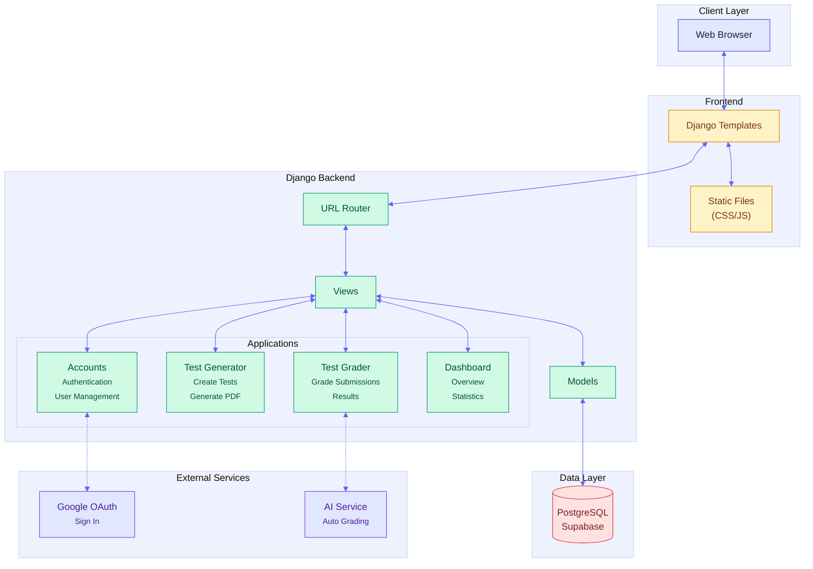

# SmartGrader
SmartGrader is a Django-based toolkit for creating, printing, scanning, and grading multiple-choice tests.

## What's inside
- `smartgrader_app/`: Django project with three apps:
  - `accounts`: custom user model.
  - `test_generator`: teacher UI and API to create tests and export printable PDFs.
  - `test_grader`: upload scanned sheets, detect answers, and store grades.
- `pdf_generator/`: standalone helper that turns a JSON test description into a printable sheet (cover, bubble grid, questions, QR).
- `grade_processor/`: OpenCV utilities to deskew sheets and detect filled bubbles for grading.
- `fonts/`: Arial/Arial-Bold TTFs used by the PDF generator.

## Requirements
- Python 3.11+ recommended.
- PostgreSQL (default database backend). SQLite works if you adjust `DATABASES` in `smartgrader_app/smartgrader_app/settings.py`.
- System packages needed for OpenCV (varies by OS).

## Setup (Windows, macOS, Linux)
```bash
python -m venv venv
# Activate
# - PowerShell: venv\Scripts\Activate.ps1
# - cmd.exe:   venv\Scripts\activate.bat
# - macOS/Linux (bash/zsh): source venv/bin/activate

pip install --upgrade pip
pip install -r requirements.txt
```

Create a `.env` file at repo root (same level as `requirements.txt`):
```
SECRET_KEY=your_django_secret
DEBUG=True
DB_NAME=smartgrader
DB_USER=your_db_user
DB_PASSWORD=your_db_password
DB_HOST=localhost
DB_PORT=5432
DB_SSL=prefer           # optional, only if you need SSL
ANTHROPIC_API_KEY=...   # only if you call Anthropic
```

Database bootstrap (PostgreSQL):
```sql
-- in psql or pgAdmin, create a user and DB
CREATE USER smartgrader_user WITH PASSWORD 'change_me';
CREATE DATABASE smartgrader OWNER smartgrader_user;
```

Run migrations and create a superuser:
```bash
cd smartgrader_app
python manage.py makemigrations
python manage.py migrate
python manage.py createsuperuser
```

Start the dev server:
```bash
python manage.py runserver
```

## Generating printable tests (standalone)
`pdf_generator/pdf_generator.py` expects a JSON file shaped like `pdf_generator/questions.json` (id, title, num_answers, questions array). Example invocation from repo root:
```bash
python - <<'PY'
from pdf_generator.pdf_generator import generate_test_pdf
generate_test_pdf("pdf_generator/questions.json", "pdf_generator/output.pdf")
print("wrote pdf_generator/output.pdf")
PY
```

## Grading OMR scans (standalone)
`grade_processor/omr_main.py` exposes helpers to deskew a sheet, detect marked bubbles, and compute a score:
```bash
python - <<'PY'
from grade_processor.omr_main import process_omr_image, grade_submission

detected = process_omr_image("path/to/scanned_sheet.jpg", num_questions=20, num_options=5)
if detected["success"]:
    result = grade_submission(detected["answers"], correct_answers=[0,1,2,3,4]*4)
    print(result)
else:
    print("failed:", detected["error"])
PY
```

## Typical teacher flow (web app)
- Sign in as a teacher, create a test in the generator UI, and export/print the PDF.
- Distribute tests; students fill bubbles.
- Upload scans in the grader UI; the app detects answers, calculates scores, and stores submissions.

## Troubleshooting
- If fonts fail to load in PDFs, ensure `fonts/arial.ttf` and `fonts/arialbd.ttf` exist.
- OpenCV errors often mean missing system packages; install OS-level OpenCV deps and rerun `pip install -r requirements.txt`.

## Project Tree

```
smartgrader/
│
├── manage.py
├── db.sqlite3
│
├── smartgrader_app/          # Main Django project settings
│   ├── settings.py
│   ├── urls.py
│   ├── wsgi.py
│   └── asgi.py
│
├── accounts/                 # User authentication & management
│   ├── models.py
│   ├── views.py
│   ├── urls.py
│   ├── signals.py
│   └── templates/accounts/
│       ├── landing.html
│       ├── login.html
│       └── register.html
│
├── dashboard/                # Dashboard functionality
│   ├── models.py
│   └── views.py
│
├── test_generator/           # Test creation module
│   ├── models.py
│   ├── views.py
│   ├── urls.py
│   ├── static/test_generator/
│   │   ├── css/
│   │   │   ├── test_detail.css
│   │   │   ├── test_generator.css
│   │   │   └── test_list.css
│   │   └── js/
│   │       ├── test_detail.js
│   │       ├── test_generator.js
│   │       └── test_list.js
│   └── templates/test_generator/
│       ├── test_detail.html
│       ├── test_generator.html
│       ├── test_list.html
│       └── _test_generator_body.html
│
├── test_grader/              # Test grading & submissions
│   ├── models.py
│   ├── views.py
│   ├── urls.py
│   ├── utils.py
│   ├── decorators.py
│   ├── static/test_grader/js/
│   │   ├── share_code.js
│   │   └── test_submissions.js
│   └── templates/test_grader/
│       ├── student_dashboard.html
│       ├── student_result.html
│       ├── student_test_access.html
│       ├── submission_detail.html
│       ├── access_denied.html
│       ├── submissions_closed.html
│       └── test_not_found.html
│
├── templates/                # Global templates
│   ├── base.html
│   ├── about.html
│   ├── help.html
│   ├── information.html
│   ├── privacy.html
│   ├── support.html
│   ├── terms.html
│   └── components/
│       ├── navbar.html
│       ├── footer.html
│       ├── sidebar.html
│       ├── login_form.html
│       ├── register_form.html
│       ├── google_sign_in_button.html
│       └── test_generator_modal.html
│
├── static/                   # Global static files
│   ├── css/
│   │   ├── variables.css
│   │   ├── navbar.css
│   │   ├── footer.css
│   │   ├── sidebar.css
│   │   ├── login_form.css
│   │   └── register_form.css
│   ├── js/
│   │   ├── navbar.js
│   │   ├── login.js
│   │   └── register.js
│   ├── img/
│   │   └── (logo files)
│   └── generated/
│       └── (generated test files)
│
└── media/                    # User uploaded files
    ├── submissions/
    └── temp/
```
## Architecture

The application follows a layered architecture with clear separation of concerns. The frontend uses Django's templating system with static CSS/JS files, while the backend is organized into four main modules: **Accounts** (authentication), **Test Generator** (test creation), **Test Grader** (submission grading), and **Dashboard** (analytics). Data is persisted in a PostgreSQL database hosted on Supabase, with external integrations for Google OAuth and AI-powered grading.

